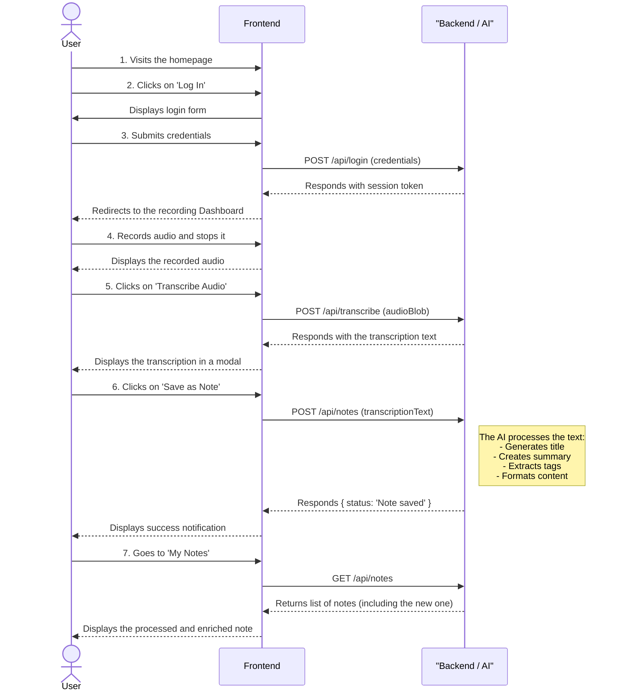

🇪🇸 **[Documentación en español -- Reto Estrategas de la IA](README.es.md)** 

# 🎙️ Astro Note Voice AI

Voice notes application with automatic AI transcription built with Astro 5, React 19, and Better Auth.


https://github.com/user-attachments/assets/869c7720-b245-491f-aae2-9163b45495b5

## User Workflow



## 🛠️ Tech Stack

- **Framework**: Astro 5 with React 19 integration
- **Language**: TypeScript (strict configuration)
- **Styling**: Tailwind CSS 4 via Vite plugin
- **Database**: libSQL (SQLite local + Turso for production)
- **Authentication**: Better Auth
- **AI**: Groq API for transcription and text processing
- **UI Components**: Radix UI + Shadcn/ui
- **Testing**: Vitest + React Testing Library

## 🚀 Quick Start

### 1. Clone and Install
```bash
git clone https://github.com/webreactiva-devs/astro-note-voice-ai-v1.git
cd astro-note-voice-ai-v1
npm install
```

### 2. Environment Variables
```bash
cp .env.example .env
```

Required variables:
```bash
# Authentication secret (generate a secure one)
BETTER_AUTH_SECRET=your-32-character-secret-here

# Groq API key for AI transcription
GROQ_API_KEY=gsk_your-groq-api-key

# Database mode (local for development)
USE_LOCAL_DB=true
```

### 3. Database Setup
```bash
# Create database directory
mkdir -p database

# Run Better Auth migrations
npx @better-auth/cli migrate --y

# Run custom migrations
npm run migrate
```

### 4. Development
```bash
npm run dev
```

Application available at `http://localhost:4321`

## 🤖 AI Prompts

The application uses structured prompts for AI processing located in `src/lib/prompts/`:
- **[Title Generation](src/lib/prompts/title-generation.md)** - Generates concise titles for voice notes
- **[Tags Generation](src/lib/prompts/tags-generation.md)** - Creates relevant tags for categorization  
- **[Idea Organization](src/lib/prompts/idea-organization.md)** - Organizes content for better readability

## 📚 Documentation

Comprehensive documentation available in the **[docs/](docs/)** folder covering architecture, specifications, development plan, and deployment guides.
