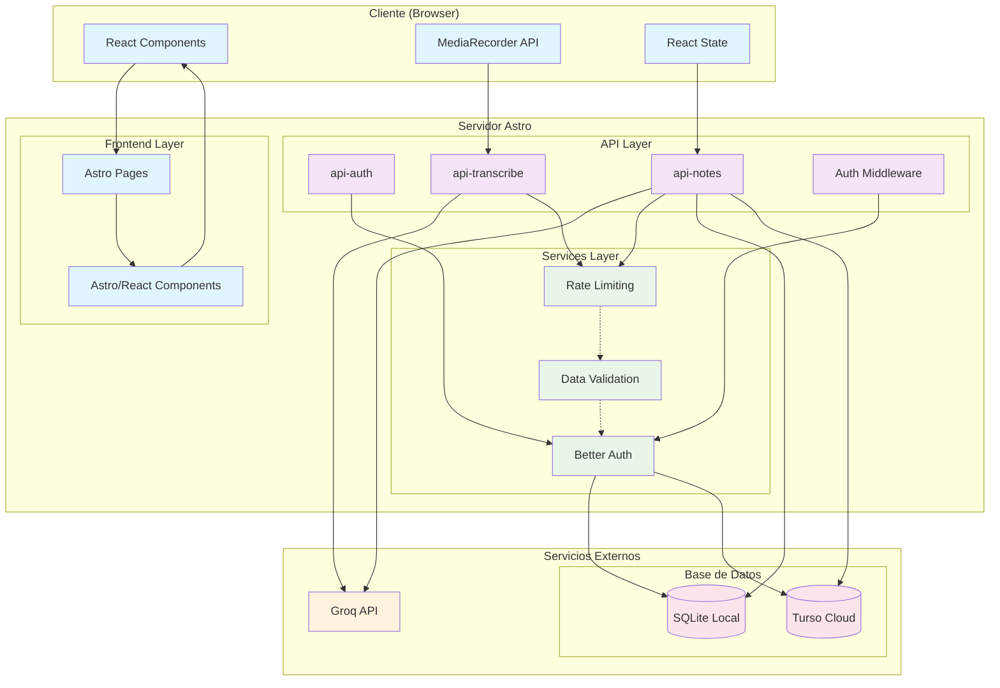
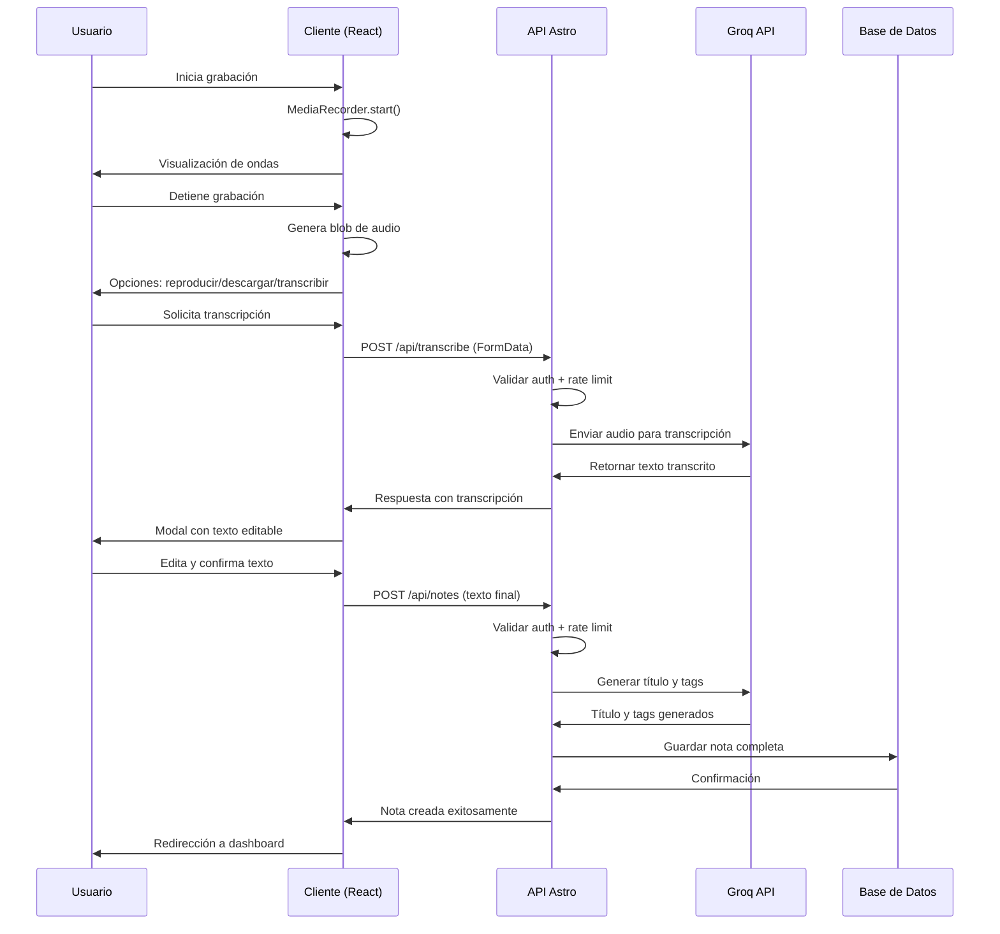
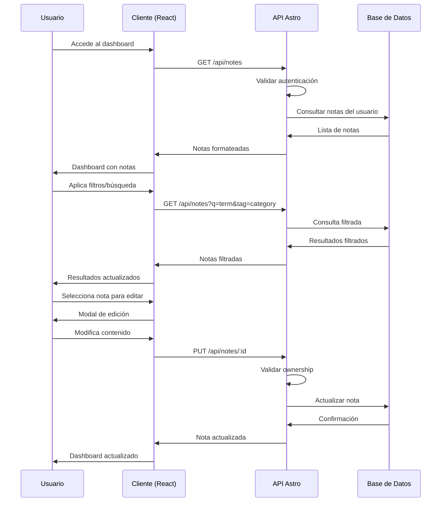
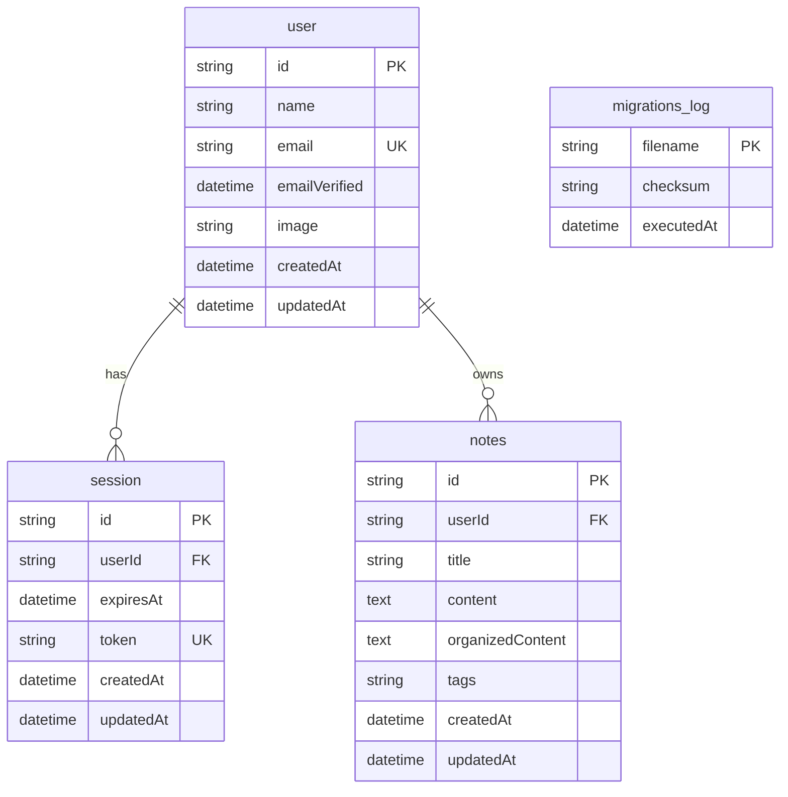
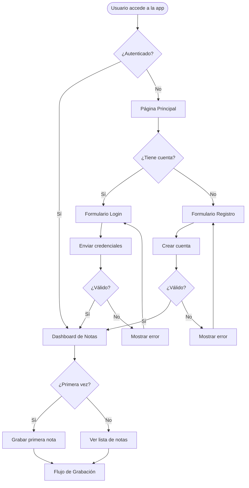
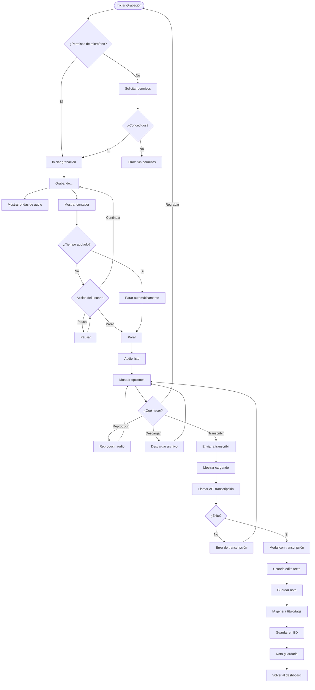
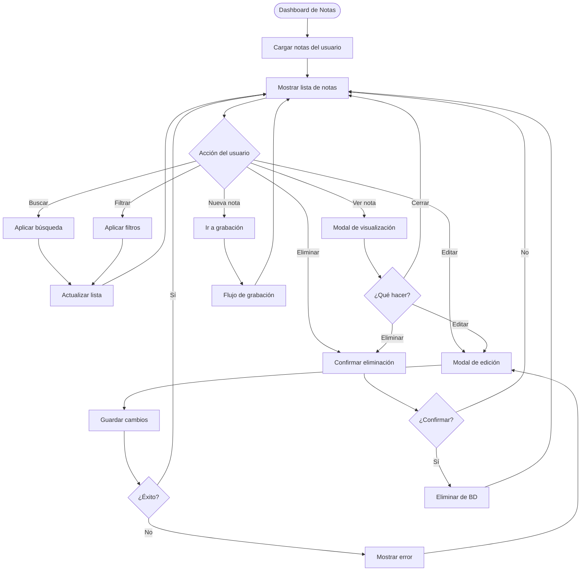
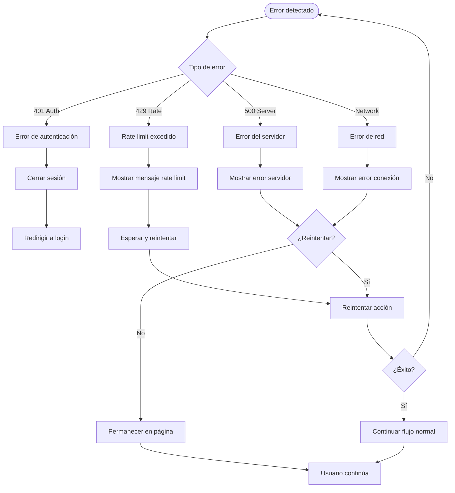

# 🏗️ Arquitectura del Proyecto - AI Astro Voice

Este documento describe la arquitectura completa del proyecto AI Astro Voice, desarrollado durante el Reto Estrategas de la IA de Web Reactiva.

## 📋 Tabla de Contenidos

1. [Diagrama de Arquitectura del Sistema](#diagrama-de-arquitectura-del-sistema)
2. [Flujo de Datos Principal](#flujo-de-datos-principal)
3. [Esquema de Base de Datos](#esquema-de-base-de-datos)
4. [Mapeo de Endpoints y APIs](#mapeo-de-endpoints-y-apis)
5. [Estructura de Carpetas](#estructura-de-carpetas)
6. [Patrones Arquitectónicos](#patrones-arquitectónicos)
7. [Diagramas de Flujo de Usuario](#diagramas-de-flujo-de-usuario)

## 🏛️ Diagrama de Arquitectura del Sistema



## 🔄 Flujo de Datos Principal

### 1. Flujo de Grabación y Transcripción



### 2. Flujo de Gestión de Notas



## 🗃️ Esquema de Base de Datos



### Descripción de Tablas

#### `user` (Gestionada por Better Auth)
- **id**: Identificador único del usuario
- **email**: Email único para autenticación
- **name**: Nombre del usuario
- **emailVerified**: Timestamp de verificación de email
- **image**: URL del avatar (opcional)

#### `notes` (Tabla principal del proyecto)
- **id**: UUID único de la nota
- **userId**: Referencia al propietario
- **title**: Título generado por IA
- **content**: Transcripción original/editada
- **organizedContent**: Contenido procesado por IA
- **tags**: JSON string con etiquetas

#### `migrations_log` (Sistema de migraciones)
- **filename**: Nombre del archivo de migración
- **checksum**: Hash del contenido para detectar cambios
- **executedAt**: Timestamp de ejecución

## 🛣️ Mapeo de Endpoints y APIs

### Endpoints de Autenticación (Better Auth)
```
POST /api/auth/sign-in          # Inicio de sesión
POST /api/auth/sign-up          # Registro de usuario  
POST /api/auth/sign-out         # Cerrar sesión
GET  /api/auth/session          # Obtener sesión actual
```

### Endpoints de la Aplicación
```
# Transcripción
POST /api/transcribe
├── Headers: Authorization, Content-Type: multipart/form-data
├── Body: FormData con archivo de audio
├── Rate Limit: 5 req/min
├── Response: { transcription: string }
└── Errors: 401, 429, 500

# Gestión de Notas
GET /api/notes
├── Headers: Authorization
├── Query Params: ?q=search&tag=filter&offset=0&limit=10
├── Rate Limit: 30 req/min
├── Response: { notes: Note[], total: number }
└── Errors: 401, 429, 500

POST /api/notes
├── Headers: Authorization, Content-Type: application/json
├── Body: { text: string }
├── Rate Limit: 30 req/min
├── Response: { note: Note }
└── Errors: 401, 422, 429, 500

PUT /api/notes/[id]
├── Headers: Authorization, Content-Type: application/json
├── Body: { title?: string, content?: string, tags?: string }
├── Rate Limit: 30 req/min
├── Response: { note: Note }
└── Errors: 401, 403, 404, 422, 429, 500

DELETE /api/notes/[id]
├── Headers: Authorization
├── Rate Limit: 30 req/min
├── Response: { success: boolean }
└── Errors: 401, 403, 404, 429, 500

# Utilidades
GET /api/db-check               # Health check de base de datos
```

### Integración con APIs Externas

#### Groq API
```
# Transcripción de Audio
POST https://api.groq.com/openai/v1/audio/transcriptions
├── Headers: Authorization: Bearer $GROQ_API_KEY
├── Body: FormData { file, model: "whisper-large-v3" }
└── Response: { text: string }

# Generación de Títulos y Tags
POST https://api.groq.com/openai/v1/chat/completions
├── Headers: Authorization: Bearer $GROQ_API_KEY
├── Body: { model: "llama-3.3-70b-versatile", messages: [...] }
└── Response: { choices: [{ message: { content: string } }] }
```

## 📁 Estructura de Carpetas

```
ai-astro-voice-manual/
├── 📁 src/
│   ├── 📁 components/           # Componentes React y Astro
│   │   ├── 📁 ui/              # Componentes base (Shadcn)
│   │   │   ├── button.tsx
│   │   │   ├── dialog.tsx
│   │   │   ├── input.tsx
│   │   │   └── ...
│   │   ├── AudioRecorder.tsx    # Grabación de audio
│   │   ├── TranscriptionModal.tsx # Modal de transcripción
│   │   ├── NoteCard.tsx        # Tarjeta de nota
│   │   ├── NoteViewModal.tsx   # Vista completa de nota
│   │   ├── NotesManager.tsx    # Gestión de notas
│   │   └── Header.astro        # Cabecera común
│   │
│   ├── 📁 lib/                 # Utilidades y configuración
│   │   ├── auth.ts            # Configuración Better Auth
│   │   ├── database.ts        # Cliente dual SQLite/Turso
│   │   ├── config.ts          # Variables de entorno
│   │   ├── rate-limit.ts      # Sistema de rate limiting
│   │   ├── validation.ts      # Esquemas de validación
│   │   └── utils.ts           # Utilidades generales
│   │
│   ├── 📁 pages/              # Rutas y páginas
│   │   ├── 📁 api/            # API Routes
│   │   │   ├── 📁 auth/       # Endpoints de Better Auth
│   │   │   ├── transcribe.ts  # Transcripción de audio
│   │   │   ├── notes/
│   │   │   │   ├── index.ts   # GET/POST /api/notes
│   │   │   │   └── [id].ts    # PUT/DELETE /api/notes/[id]
│   │   │   └── db-check.ts    # Health check
│   │   ├── index.astro        # Página principal
│   │   ├── dashboard.astro    # Dashboard (redirige a /notes)
│   │   ├── notes.astro        # Gestión de notas
│   │   ├── record.astro       # Grabación de audio
│   │   ├── profile.astro      # Perfil de usuario
│   │   ├── login.astro        # Inicio de sesión
│   │   └── register.astro     # Registro
│   │
│   └── 📁 styles/             # Estilos globales
│       └── globals.css
│
├── 📁 database/               # Base de datos
│   ├── 📁 migrations/         # Migraciones SQL
│   │   ├── 001_create_notes_table.sql
│   │   └── 002_add_organized_content.sql
│   └── dev.db                 # SQLite local (git ignored)
│
├── 📁 scripts/                # Scripts de utilidad
│   ├── migrate.js            # Sistema de migraciones
│   ├── clean-migration.js    # Limpieza de migraciones
│   └── check-bundle-size.js  # Verificación de bundle
│
├── 📁 docs/                   # Documentación
│   ├── project-specs.md      # Especificaciones técnicas
│   ├── project-plan.md       # Plan de desarrollo
│   ├── project-architecture.md # Este documento
│   ├── deployment.md         # Guía de despliegue
│   └── betterauth.md         # Configuración de auth
│
├── 📁 public/                 # Assets estáticos
├── 📁 tests/                  # Tests automatizados
│   ├── 📁 api/               # Tests de endpoints
│   ├── 📁 components/        # Tests de componentes
│   └── setup.ts              # Configuración de tests
│
├── astro.config.mjs          # Configuración Astro
├── tailwind.config.mjs       # Configuración Tailwind
├── tsconfig.json             # Configuración TypeScript
├── vitest.config.ts          # Configuración de tests
├── package.json              # Dependencias y scripts
├── .env.example              # Variables de entorno ejemplo
├── README.md                 # Documentación principal
└── README.es.md              # Documentación en español
```

## 🎯 Patrones Arquitectónicos Aplicados

### 1. **Arquitectura de Capas (Layered Architecture)**
```
┌─────────────────────┐
│   Presentation     │ ← React Components, Astro Pages
├─────────────────────┤
│   API Layer        │ ← API Routes, Middleware
├─────────────────────┤
│   Business Logic   │ ← Services, Validation
├─────────────────────┤
│   Data Access      │ ← Database, External APIs
└─────────────────────┘
```

### 2. **Patrón Repository (Implícito)**
- Abstracción de acceso a datos en `src/lib/database.ts`
- Soporte dual SQLite/Turso sin cambios en la lógica de negocio
- Funciones específicas para cada entidad (usuarios, notas)

### 3. **Middleware Pattern**
- Middleware de autenticación centralizado
- Rate limiting aplicado transversalmente
- Validación de datos en capa intermedia

### 4. **Factory Pattern**
- Configuración de clientes de base de datos
- Instanciación de servicios según entorno
- Creación de mocks para testing

### 5. **Strategy Pattern**
- Diferentes estrategias de almacenamiento (local vs cloud)
- Múltiples formatos de exportación (futuro)
- Variaciones en procesamiento de IA

### 6. **Observer Pattern (React)**
- Estados reactivos en componentes
- Actualizaciones automáticas del dashboard
- Notificaciones de cambios de estado

## 👤 Diagramas de Flujo de Usuario

### 1. Flujo de Autenticación



### 2. Flujo de Grabación y Transcripción



### 3. Flujo de Gestión de Notas



### 4. Flujo de Estados de Error y Recuperación



---

## 📚 Referencias y Documentación Relacionada

- **[Especificaciones Técnicas](project-specs.md)**: Requisitos detallados del proyecto
- **[Plan de Desarrollo](project-plan.md)**: Progreso y tareas completadas
- **[Guía de Despliegue](deployment.md)**: Configuración para producción
- **[Configuración de BetterAuth](betterauth.md)**: Setup de autenticación

---

*Documentación generada para el Reto Estrategas de la IA de Web Reactiva*
